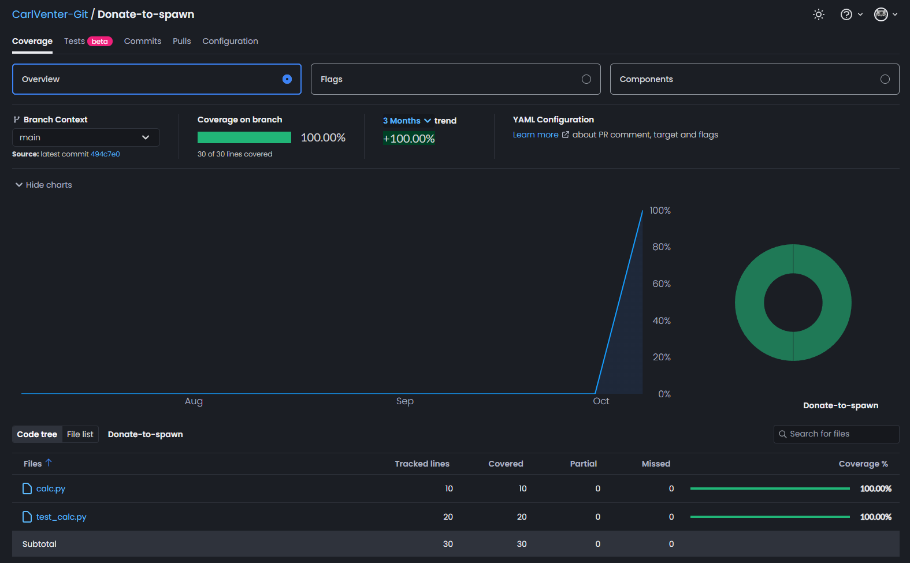
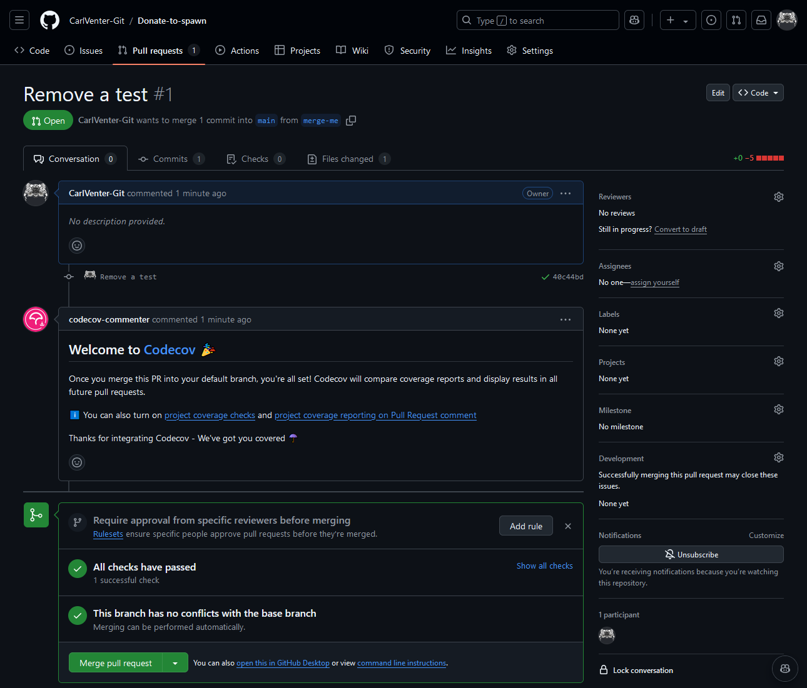

# Code Coverage Reports with Pytest

If you’re using pytest for testing in your Python projects, you may have heard about code coverage reports. These reports provide insight into how much of your codebase is being tested and can be a valuable tool for improving the quality and reliability of your code.

In this article, we’ll walk through how to set up, generate, and interpret pytest code coverage reports and extend their functionality to better share and make decisions. This will help you maximize the effectiveness of your tests.

## What is Code Coverage?

Code coverage measures the percentage of your code that is executed when tests are run. It helps identify untested parts of your codebase, guiding you on where to focus additional testing. Coverage metrics often include:

* **Statement Coverage:** Checks if each statement in your code has been executed
* **Branch Coverage:** Tests whether every possible branch (e.g., `if/else`) has been executed
* **Function Coverage:** Ensures each function in your code has been invoked
* **Line Coverage:** Determines if each line of code has been executed

`pytest`, a powerful and flexible Python testing framework, can be extended with the `pytest-cov` plugin to provide code coverage reports, making it easy to get started with tracking and improving your test coverage.

## Setting Up Pytest for Code Coverage

First you need to set up pytest to generate coverage reports. The `pytest-cov` plugin is a popular choice for this.

### Install Pytest and Pytest-Cov

Ensure pytest and pytest-cov are installed in your project. You can add them using pip:

```bash
pip install pytest pytest-cov
```

### Running Tests with Coverage

To run your tests with coverage enabled, use the command with the following format:

```bash
pytest --cov=<your_package_name> --cov-report=<output_format>
```

* **--cov=<your_package_name>:** Specifies the package you want to measure coverage for
* **--cov-report=<output_format>:** Specify the format in which the report should be generated

For example:

```bash
pytest --cov=myapp 
```

This will output a coverage summary directly in your terminal.

---

## Generate Detailed Coverage Reports

To generate HTML reports that provide a more detailed view of your coverage, you can modify the command:

```bash
pytest --cov=myapp --cov-report=xml
```

This will create an htmlcov directory containing an html report you can open in your browser for deeper analysis.


---

## Codecov Integration with Pytest Coverage Reports

Integrating pytest with Codecov enables you to track and visualize the code coverage metrics you generate over time. Codecov is a service that integrates with existing CI/CD pipelines, providing insights into your testing coverage.

Below are the steps to set up and integrate Codecov with your existing Jest setup.

### Set Up Codecov for Your Repository

First, [create](https://about.codecov.io/codecov-free-trial/) an account on Codecov and link it to your version control platform, refer to the [quick start guide](https://docs.codecov.com/docs/quick-start) for more details on these steps.  
Codecov will generate a unique token for your project, which you will need to save as a **Repository Secret** to upload the coverage reports securely.

### Add Codecov to Your CI Pipeline

In your GitHub Actions CI configuration file, use the Codecov application to pass the coverage report to Codecov. Below is an example of a GitHub Actions `workflow.yml`:

```yaml
name: CI
on:
  push:
    branches: [ "main" ]
  pull_request:
    branches: [ "main" ]
jobs:
  test:
    name: Run tests and collect coverage
    runs-on: ubuntu-latest
    steps:
      - name: Checkout
        uses: actions/checkout@v4
        with:
          fetch-depth: 0

      - name: Set up Python
        uses: actions/setup-python@v4

      - name: Install dependencies
        run: pip install pytest pytest-cov

      - name: Run tests
        run: pytest --cov --cov-report=xml

      - name: Upload results to Codecov
        uses: codecov/codecov-action@v4
        with:
          token: ${{ secrets.CODECOV_TOKEN }}
```

Explanation of the steps:

* **Checkout code:** Retrieves your repository code
* **Set up Node.js:** Configures the environment with the desired Node.js version
* **Run tests with coverage:** Executes your tests with the --coverage flag, generating the coverage report
* **Upload results to Codecov:** Uses the Codecov GitHub application to send the coverage report

**NOTE:** The value for ``${{ secrets.CODECOV_TOKEN }}`` can be found in your Codecov project settings (store this token securely as a secret in your CI environment).

### View Coverage Reports on Codecov

After setting up Codecov in your CI pipeline, every new build will upload coverage data. You can access the reports through your Codecov dashboard, where you’ll find:

* A summary of your project’s coverage metrics
* A breakdown of coverage per file, showing which files are under-tested
* Visualizations of coverage changes between commits, branches, or pull requests



### Pull Request Reports

After you have installed the GitHub application and connected your repo to Codecov, you will see the a message when you open you next pull request to the `main` branch.



And every subsequent pull request that is opened will have a comment added by the Codecov bot that gives a quick summary of your coverage.


### Enforcing Coverage Thresholds

Codecov lets you enforce minimum coverage thresholds, so if coverage drops below a set percentage, your build can fail automatically. Add a `codecov.yml` file to your repository’s root to configure these settings:

```yaml
coverage:
  status:
    project:
      default:
        target: 80%
    patch:
      default:
        target: 80%
```

In this example:

* **project:** sets the target for overall project coverage.
* **patch:** sets the target for new code introduced in pull requests.

These thresholds ensure that new changes do not decrease the code coverage below acceptable levels.
